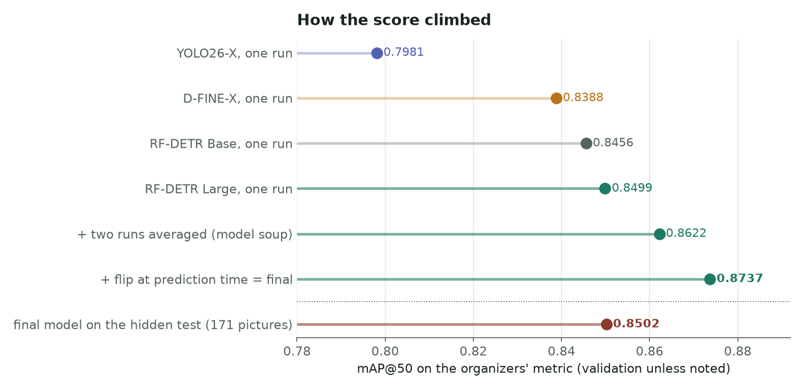
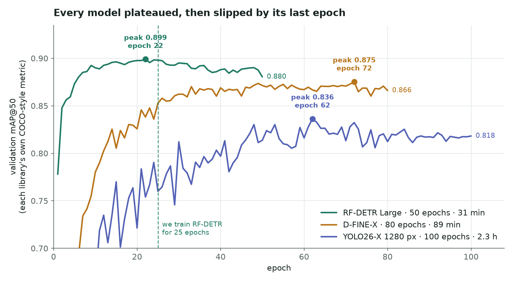

# Lockheed Martin AI & ML Technologies Hackathon - Plastic Bag Detection (2nd place)

Our 2nd place solution for the plastic bag detection challenge at the Lockheed Martin AI & ML Technologies Hackathon (UPRM, Sep 25-27, 2026).

**Val mAP@50: 0.8737 · Test mAP@50: 0.8502** (organizers' metric, 171 test images)

## Solution

- **Model:** RF-DETR Large (DINOv2 backbone) at 704px, fine-tuned from the COCO weights
- **Training:** train split only, 25 epochs, batch 4 with 4 grad accumulation steps, default lr and augmentations
- **Model soup:** trained 2 seeds and averaged their weights into one model
- **TTA:** predict on each image and its horizontal flip, then merge the boxes with NMS (IoU 0.6)

Everything is in one notebook: [`event_materials/rfdetr_plastic_bags.ipynb`](event_materials/rfdetr_plastic_bags.ipynb)

## Results

| | val mAP@50 |
|---|---|
| YOLO26-X | 0.798 |
| D-FINE-X | 0.839 |
| RF-DETR Base | 0.846 |
| RF-DETR Large | 0.850 |
| + 2 seed soup | 0.862 |
| + flip TTA (final) | **0.874** |
| final on test | **0.850** |



## Why 25 epochs

We first trained every model for longer and checked val after each epoch. They all peaked and then started dropping. RF-DETR peaked at epoch 22 of 50, so we went with 25. Training for 27 or 30 epochs scored lower.



## What didn't work

Small changes could move val by about 0.015, so we only switched to something if it beat our best by at least 0.01. None of these did:

- ensembling RF-DETR with YOLO and D-FINE (WBF)
- 896px (worse) and 640px (same)
- lr schedules, lower or higher lr, layer-wise lr decay
- extra augmentations (color, vertical flip, cutout)
- focal loss, class loss weight, EMA decay
- 27 and 30 epochs, duplicating the train boxes
- more TTA views (vertical flip, other sizes)
- a 3 seed soup

## Notes

- The organizers' metric is 11-point VOC AP, which is harsher than the usual mAP@50. Our same predictions get 0.908 with the COCO-style 101-point version.
- Most of the confident false positives on val are real bags that just weren't labeled (77% of the top ones we checked).
- The 640x480 camera images are the hardest (0.80 on val vs 0.88 for the 1280x720 ones).
- The first training step crashed on SageMaker because of Triton, so the train cell falls back to the CPU matcher.

## Running it

The data isn't included. Put it next to the notebook like this:

```
data/training/image  data/training/label
data/val/image       data/val/label
event_materials/rfdetr_plastic_bags.ipynb
```

Open the notebook and run all. Training takes about 16 min per seed on an A10G. If `runs/rfdetr_large_704/model.pt` already exists, it skips training and goes straight to scoring. The last cell downloads and scores the test set, and it only runs if you paste in the AWS keys from the organizers.

We used AWS SageMaker with 1x NVIDIA A10G (24 GB).

`python make_charts.py` redraws the two charts above. The per-epoch scores come from our training logs and are saved in `assets/epoch_scores.csv`.

## Credits

- [RF-DETR](https://github.com/roboflow/rf-detr) by Roboflow
- `evaluate_map50` in the notebook comes from the organizers' starter notebook, so our scores match theirs
- Thanks to Lockheed Martin and Pink Pandas (UPRM Women in Cybersecurity) for running the hackathon

## Additional with other models
We tested another instance yolo26x which got a score on mAP@50 of 83%. After adjusting parameters the results plummeted. Yolo26s was also tested with more promising results upon adjusting parameters but not beating the initial 83%. We also tested model souping on Yolo26s but did not get promising results, around 50% on mAP@50. 

MIT License
